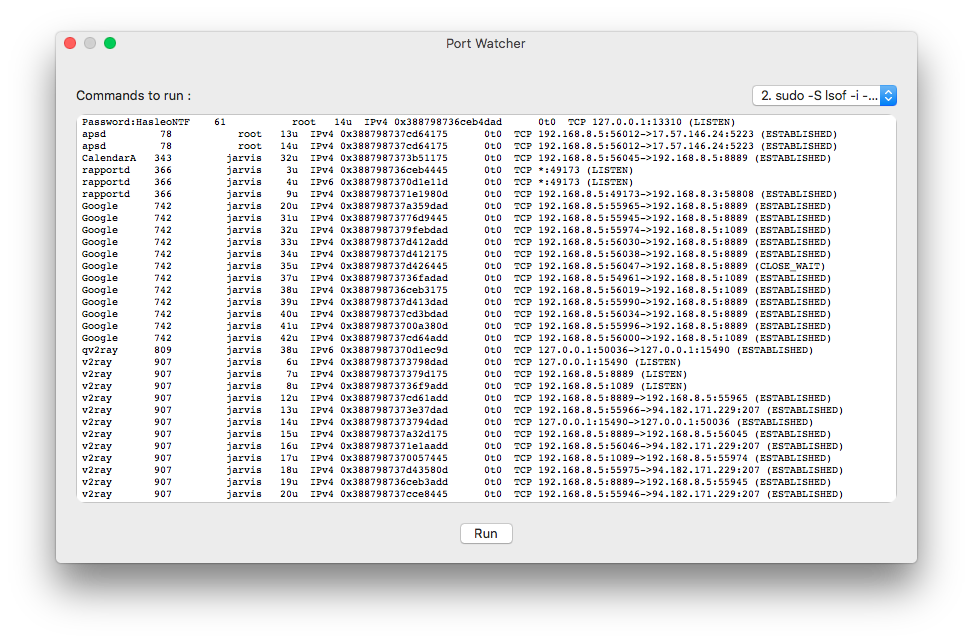

# portWatcher

macOS tool to check ports in use

It's written in Swift and built by XCode 10.1 on macOS High Sierra
It is compatible with ARM MacBooks too (M1, M2, M3, ...)

### Screenshot

---

---

### Version

This is version 2.5

## Requirements

macOS 10.13+

netstat

coreutils

## Compile

To build this app yourself, makes sure you have :

XCode 10.1+

Swift 4.5+

macOS 10.13+

## Thanks

Amir Mohammad Safari (Idea & Developer)
